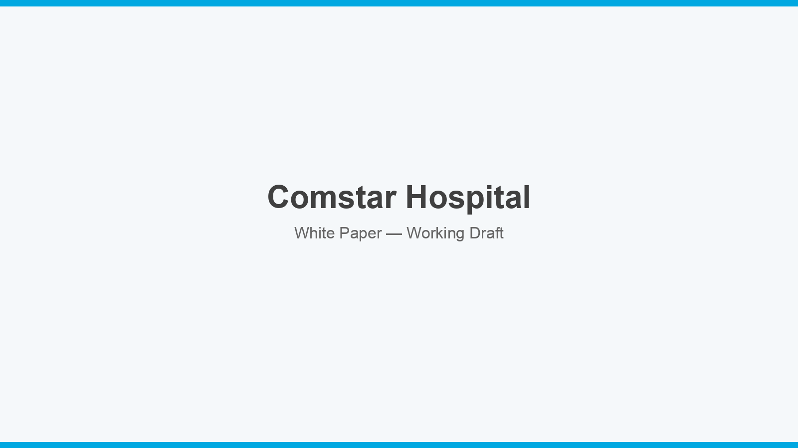

<!-- Hero image: replace assets/hero.png once finalised. Recommended 1600px wide, 16:9 or wider. -->


# Comstar Hospital

### White Paper

**Working draft**

[](https://creativecommons.org/licenses/by/4.0/)


### 📄 [Download the white paper (PDF)](COMSTAR-HOSPITAL_WhitePaper_Beta_v1.0.pdf)

---

## What this is

Public release repository for the Comstar Hospital white paper.

Working sources live in [white-papers](https://github.com/zlatko-lakisic/white-papers) under [`papers/comstar-hospital/`](https://github.com/zlatko-lakisic/white-papers/tree/main/papers/comstar-hospital). Build the PDF from the repository root with:

```bash
./build.sh comstar-hospital --check
```

Replace this landing copy with paper-specific summary text once the draft body is in place.

---

## Executive summary

_Stub. The published summary will mirror the paper's executive summary._

---

## What the paper covers

| Section | Contents |
|---|---|
| **Executive Summary** | TBD |
| **Body** | TBD |

---

## License

Licensed under [Creative Commons Attribution 4.0 International](https://creativecommons.org/licenses/by/4.0/) (CC BY 4.0).

You are free to share and adapt this material, including commercially, provided you give appropriate credit.

See [LICENSE](LICENSE) and [LICENSE.md](LICENSE.md).

---

## Feedback

Corrections and suggestions are welcome. Open an issue or reach out directly.

**Zlatko Lakisic**
[Portfolio](https://zlatko-lakisic.github.io/zlatko-lakisic/) · [LinkedIn](https://www.linkedin.com/in/zlatko-lakisic/)
